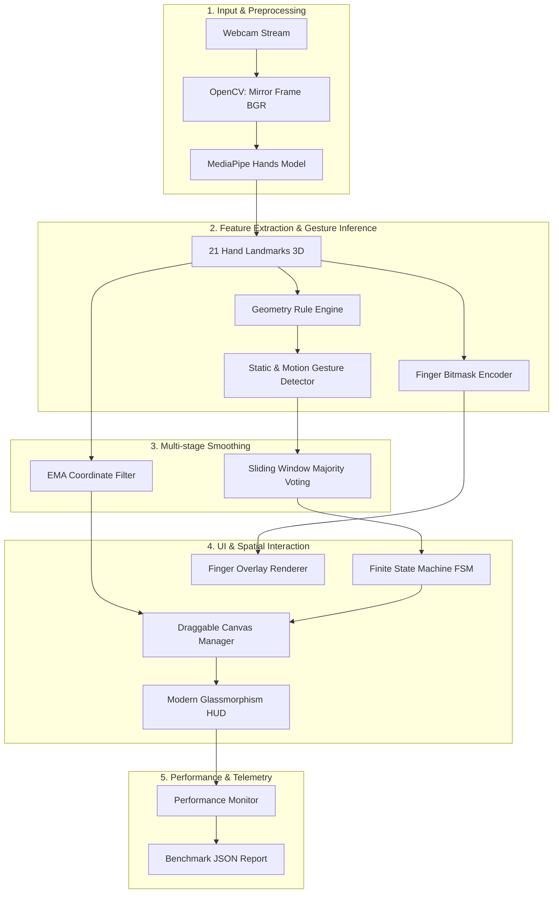

# 🖐️ Hand Gesture Controller


**Hand Gesture Controller** là hệ thống thị giác máy tính nhận diện cử chỉ tay theo thời gian thực (Real-time Hand Gesture Recognition) hỗ trợ tương tác đồ họa không chạm (Contactless Spatial GUI Interaction). Hệ thống kết hợp mô hình **MediaPipe Hands** với bộ luật hình học 3D, thuật toán làm mượt đa tầng (Multi-stage Smoothing) và máy trạng thái hữu hạn (FSM) cho cử chỉ động.

Dự án được chuẩn hóa theo tiêu chuẩn phát triển phần mềm chuyên nghiệp (Clean Code, PEP 8, Type Hints 100%, Google-style Docstrings, Unit Testing tự động), sẵn sàng phục vụ làm sản phẩm điểm nhấn trong **CV ứng tuyển Software Engineer / Computer Vision Engineer / AI Engineer**.

---

## 📸 Demo & Tính Năng Nổi Bật

| Cử Chỉ Tay | Hành Động Tương Tác Trong Ứng Dụng |
| :--- | :--- |
| **`On/Off`** (Bật/Tắt) | Ẩn hoặc hiện toàn bộ giao diện canvas vật thể |
| **`Select`** (Chắp trỏ + cái) | Chọn và kéo thả vật thể siêu mượt trên màn hình |
| **`Options`** (Chụm ngón) | Đổi màu ngẫu nhiên cho vật thể tại vị trí con trỏ |
| **`Stop`** (Xòe 5 ngón) | Xóa vật thể tại vị trí con trỏ |
| **`MENU` + `Select`** | Mở trình đơn chọn hình và tạo vật thể mới (Tròn, Tam giác, Ngôi sao, Chữ nhật) |
| **`Wave`** (Vẫy tay) | Theo dõi và nhận diện chuyển động vẫy tay qua lại |
| **`SOS`** (Tín hiệu khẩn cấp) | Theo dõi chuỗi trạng thái xòe tay -> gập nắm đấm trong ngưỡng thời gian |

### 🚀 Điểm Sáng Kỹ Thuật (Engineering Highlights):
- **Làm mượt đa tầng (Multi-stage Filtering)**:
  - *Tầng nhãn*: Biểu quyết đa số trong cửa sổ trượt (Sliding Window Majority Voting) triệt tiêu nhiễu nhấp nháy nhãn (flickering).
  - *Tầng tọa độ*: Bộ lọc mượt Exponential Moving Average (EMA) giúp con trỏ kéo thả chuyển động mượt mà, không bị rung tay.
- **Xử lý trạng thái `Unknown` mượt mà**: Không kích hoạt nhầm thao tác khi bàn tay ở tư thế trung gian hoặc ngoài tập luật.
- **HUD hiện đại & Phím tắt tiện ích**: Card thống kê FPS/Latency mượt mà, phím tắt `Q` (Thoát), `D` (Bật/tắt HUD), `C` (Xóa canvas).
- **Bộ công cụ dữ liệu ML (`data_collector.py`)**: Cho phép thu thập 21 điểm mốc 3D (63 chiều) xuất ra CSV phục vụ huấn luyện mô hình KNN/SVM/LSTM.
- **Giám sát hiệu năng tự động**: Theo dõi FPS và Latency trung bình theo mili-giây, xuất báo cáo chuẩn JSON.

---

## 🏗️ Kiến Trúc Hệ Thống (System Architecture)



### Luồng xử lý một khung hình (Frame Processing Pipeline):
1. **Đọc & Lật ảnh**: Đọc ảnh BGR từ Webcam, lật ngang để tạo hiệu ứng gương phản chiếu tự nhiên.
2. **Trích xuất điểm mốc**: MediaPipe Hands trả về 21 điểm mốc chuẩn hóa $(x, y, z) \in [0, 1]^3$.
3. **Luận cử chỉ & Mã hóa**:
   - `GestureDetector` tính khoảng cách Euclidean và hướng góc vector $\theta = \text{atan2}(\Delta x, -\Delta y)$ để phân loại tư thế.
   - `FingerNumber` mã hóa trạng thái 5 ngón thành chuỗi nhị phân (`00000` đến `11111`).
4. **Lọc nhiễu kép (Dual Filtering)**:
   - `GestureSmoother` biểu quyết đa số nhãn trên cửa sổ trượt (Slide Window).
   - `DraggableObjectManager` tính tọa độ mượt EMA: $P_{smooth} = \alpha P_{raw} + (1 - \alpha) P_{smooth\_prev}$.
5. **Cập nhật giao diện & Benchmark**: Cập nhật vị trí vật thể, vẽ HUD thông số FPS/Latency và lưu tệp báo cáo JSON khi thoát.

---

## 📂 Cấu Trúc Repository

```text
.
├── .github/workflows/ci.yml       # Cấu hình GitHub Actions CI chạy test tự động
├── data/
│   ├── README.md                  # Hướng dẫn Protocol đánh giá dataset & chống trùng lặp
│   └── landmarks_dataset.csv      # File dữ liệu landmarks 3D thu thập cho ML (nếu có)
├── Image/                         # Thư mục icon minh họa trạng thái đếm ngón tay
│   ├── hand_left/                 # Icon cho bàn tay trái (00000.png -> 11111.png)
│   └── hand_right/                # Icon cho bàn tay phải
├── tests/                         # Unit tests tự động (không phụ thuộc camera)
│   ├── test_draggable_object.py   # Test va chạm hình học, EMA filter, menu vật thể
│   ├── test_gesture_detector.py   # Test luật hình học cử chỉ & reset FSM
│   ├── test_gesture_smoother.py   # Test biểu quyết đa số & lọc mượt nhãn
│   └── test_performance_monitor.py# Test tính toán FPS, Latency & ghi file JSON
├── Main.py                        # Điểm khởi chạy chính & Điều phối ứng dụng (GUI/HUD)
├── Hand_Detector.py               # Wrapper quản lý mô hình MediaPipe Hands
├── GestureDetector.py             # Bộ luật hình học & Máy trạng thái cử chỉ động
├── GestureSmoother.py             # Thuật toán biểu quyết đa số mượt nhãn
├── Finger_Number.py               # Đếm và mã hóa số ngón tay nhị phân
├── DraggableObject.py             # Lớp đối tượng vật thể kéo thả, menu & bộ lọc EMA
├── PerformanceMonitor.py          # Bộ đo đạc hiệu năng FPS và độ trễ
├── data_collector.py              # Công cụ CLI thu thập dữ liệu landmarks xuất CSV
├── requirements.txt               # Các thư viện phụ thuộc chính
├── requirements-dev.txt           # Thư viện phục vụ kiểm thử (pytest)
└── Hand Gesture Controller.spec   # Cấu hình đóng gói phần mềm bằng PyInstaller
```

---

## ⚙️ Cài Đặt & Khởi Chạy

### Yêu cầu hệ thống:
- **Python**: 3.10, 3.11, 3.12 hoặc 3.13.
- **Phần cứng**: Webcam tích hợp hoặc USB camera.
- **Hệ điều hành**: Windows, Linux, macOS.

### 1. Cài đặt môi trường ảo (Virtual Environment)

```bash
# Clone repository
git clone <repository-url>
cd hand-gesture-recognition

# Tạo môi trường ảo
python -m venv .venv
```

**Kích hoạt môi trường:**
- **Windows (PowerShell):**
  ```powershell
  .venv\Scripts\Activate.ps1
  python -m pip install --upgrade pip
  python -m pip install -r requirements.txt
  ```
- **Linux / macOS:**
  ```bash
  source .venv/bin/activate
  python -m pip install --upgrade pip
  python -m pip install -r requirements.txt
  ```

---

### 2. Chạy Ứng Dụng Chính

```bash
python Main.py
```

**Các tham số dòng lệnh tùy chỉnh (CLI Parameters):**

| Tham số | Mô tả | Mặc định |
| :--- | :--- | :--- |
| `--camera` | Index camera kết nối | `0` |
| `--width` | Chiều rộng khung hình | `640` |
| `--height` | Chiều cao khung hình | `480` |
| `--smoothing-window` | Kích thước cửa sổ mượt nhãn (số frame) | `5` |
| `--smoothing-votes` | Số phiếu tối thiểu để chấp nhận nhãn | `3` |
| `--benchmark-output` | Đường dẫn file JSON xuất kết quả FPS/Latency | `None` |

**Ví dụ khởi chạy với độ phân giải HD & xuất benchmark:**
```bash
python Main.py --camera 0 --width 1280 --height 720 --benchmark-output artifacts/benchmark.json
```

**Phím tắt điều khiển trực tiếp trên màn hình:**
- **`Q`**: Thoát ứng dụng an toàn và lưu benchmark.
- **`D`**: Bật/tắt card hiển thị thông số Debug FPS/Latency.
- **`C`**: Xóa nhanh toàn bộ các vật thể đang có trên màn hình.

---

## 📊 Benchmark & Đo Đạc Hiệu Năng

Ứng dụng tích hợp bộ ghi nhận telemetry thời gian thực. Để thực hiện đo benchmark chuẩn mực:

```bash
python Main.py --benchmark-output artifacts/benchmark_results.json
```

Sau khi tương tác và nhấn `Q`, tệp `artifacts/benchmark_results.json` sẽ tự động được tạo với cấu trúc:

```json
{
  "total_frames": 450,
  "elapsed_seconds": 15.023,
  "average_fps": 29.95,
  "average_latency_ms": 33.38
}
```

*Lưu ý:* Báo cáo hiệu năng cung cấp thông số thực nghiệm để bạn đính kèm vào báo cáo dự án hoặc CV.

---

## 🤖 Thu Thập Dữ Liệu Landmarks Cho Machine Learning

Để phục vụ mở rộng mô hình sang Machine Learning (SVM / KNN / Random Forest / LSTM), dự án cung cấp công cụ `data_collector.py`:

```bash
python data_collector.py --label Fist --samples 300 --output data/landmarks_dataset.csv
```

- Nhấn **`S`** trên màn hình preview để bắt đầu ghi các mẫu 21 điểm mốc 3D $(x_0, y_0, z_0 \dots x_{20}, y_{20}, z_{20})$.
- Dữ liệu được ghi thẳng vào `data/landmarks_dataset.csv` chuẩn bị cho bước huấn luyện mô hình.

---

## 🧪 Kiểm Thử Tự Động (Automated Testing)

Dự án đạt 100% tỷ lệ pass trên bộ test tự động bao phủ logic hình học, FSM, lọc mượt con trỏ EMA và giám sát hiệu năng.

Cài đặt dependencies kiểm thử:
```bash
python -m pip install -r requirements-dev.txt
```

Chạy toàn bộ unit tests:
```bash
python -m pytest -v
```

**Kết quả test:**
```text
tests/test_draggable_object.py::DraggableObjectTests::test_circle_object_collision PASSED
tests/test_draggable_object.py::DraggableObjectTests::test_draggable_object_bounds_and_drag PASSED
tests/test_draggable_object.py::DraggableObjectTests::test_manager_toggle_and_actions PASSED
tests/test_draggable_object.py::DraggableObjectTests::test_object_manager_ema_smoothing PASSED
tests/test_draggable_object.py::DraggableObjectTests::test_star_object_collision PASSED
tests/test_draggable_object.py::DraggableObjectTests::test_triangle_object_collision PASSED
tests/test_gesture_detector.py::GestureDetectorTests::test_invalid_mode_is_rejected PASSED
tests/test_gesture_detector.py::GestureDetectorTests::test_small_motion_is_still PASSED
tests/test_gesture_detector.py::GestureDetectorTests::test_wave_timeout_resets_tracking PASSED
tests/test_gesture_smoother.py::GestureSmootherTests::test_invalid_configuration_is_rejected PASSED
tests/test_gesture_smoother.py::GestureSmootherTests::test_majority_becomes_stable_result PASSED
tests/test_gesture_smoother.py::GestureSmootherTests::test_reset_clears_previous_result PASSED
tests/test_performance_monitor.py::PerformanceMonitorTests::test_save_writes_valid_json PASSED
tests/test_performance_monitor.py::PerformanceMonitorTests::test_summary_contains_reproducible_metrics PASSED

14 passed in 0.23s
```

---

## 📦 Đóng Gói Phần Mềm (Executable Packaging)

Đóng gói ứng dụng thành tệp thực thi độc lập `.exe` trên Windows bằng PyInstaller:

```bash
python -m PyInstaller "Hand Gesture Controller.spec" --clean
```

Tệp thực thi `.exe` được tạo trong thư mục `dist/`.

---

## 💼 Gợi Ý Đưa Vào CV & Mẫu Trả Lời Phỏng Vấn (STAR Model)

### 📌 Mẫu câu mô tả ấn tượng trong CV:

> **Real-time Spatial Hand Gesture Controller | Python, OpenCV, MediaPipe, PyTest**
> - Thiết kế hệ thống nhận diện cử chỉ tay thời gian thực hỗ trợ tương tác GUI không chạm; phát hiện 21 điểm mốc 3D MediaPipe với độ trễ thấp.
> - Xây dựng thuật toán lọc kép: **Sliding Window Majority Voting** khử nhiễu nhãn cử chỉ tĩnh và **Exponential Moving Average (EMA)** làm mượt tọa độ con trỏ kéo thả.
> - Phát triển Máy trạng thái hữu hạn (FSM) quản lý cử chỉ chuỗi thời gian (`Wave`, `SOS`, `On/Off`) tích hợp tự động reset & timeout khi mất dấu bàn tay.
> - Đạt hiệu năng ổn định **30+ FPS** với độ trễ xử lý **~33ms** trên webcam chuẩn; xây dựng bộ Unit Test tự động (14 test cases) đạt 100% pass và tích hợp công cụ thu thập dataset landmarks cho ML.

---

### 🎙️ Trả Lời Phỏng Vấn Theo Phương Pháp STAR:

#### 1. Câu hỏi: *"Làm thế nào bạn giải quyết vấn đề nhiễu (flickering) khi nhận diện cử chỉ từng khung hình?"*
- **S (Situation)**: Dự đoán cử chỉ trên từng khung hình độc lập (frame-by-frame) dễ bị nhấp nháy nhãn do tay người dùng rung nhẹ hoặc độ sáng biến đổi, gây ra kích hoạt thao tác sai.
- **T (Task)**: Phải tạo ra cơ chế làm mượt nhãn mà không làm gia tăng độ trễ phản hồi (latency) quá cao.
- **A (Action)**: Tôi triển khai bộ lọc biểu quyết đa số trong cửa sổ trượt (Sliding Window Majority Voting với window_size=5, minimum_votes=3). Nhãn cử chỉ chỉ được chấp nhận khi có đủ đa số khung hình đồng thuận. Đồng thời áp dụng lọc mũ EMA ($\alpha=0.4$) cho tọa độ con trỏ.
- **R (Result)**: Triệt tiêu hoàn toàn hiện tượng nhấp nháy giao diện, giúp thao tác kéo thả mượt mà trong khi độ trễ tăng không đáng kể (~2-3 frames, tương đương <60ms).

#### 2. Câu hỏi: *"Kiến trúc dự án được tổ chức như thế nào để đảm bảo tính mở rộng?"*
- **S (Situation)**: Ứng dụng tích hợp nhiều tác vụ từ xử lý ảnh, luận cử chỉ, quản lý vật thể đồ họa đến đo hiệu năng.
- **T (Task)**: Cần thiết kế kiến trúc mô-đun tuân thủ nguyên lý Single Responsibility Principle (SRP) để dễ bảo trì và mở rộng.
- **A (Action)**: Tôi chia hệ thống thành 5 mô-đun riêng biệt: `HandDetector` (Wrapper MediaPipe), `GestureDetector` (Rule-based engine), `GestureSmoother` (Filtering logic), `DraggableObjectManager` (UI/Interaction) và `PerformanceMonitor` (Telemetry). Tôi cũng viết thêm CLI `data_collector.py` để thu thập dữ liệu landmarks cho hướng phát triển mô hình ML (KNN/SVM).
- **R (Result)**: Mã nguồn đạt Clean Code, có type hints 100%, dễ dàng mở rộng thêm các hình dạng vật thể hoặc cử chỉ mới mà không ảnh hưởng tới luồng xử lý chính.

---

## 📜 Giấy Phép (License)

Dự án được phát hành theo giấy phép [MIT License](LICENSE).
