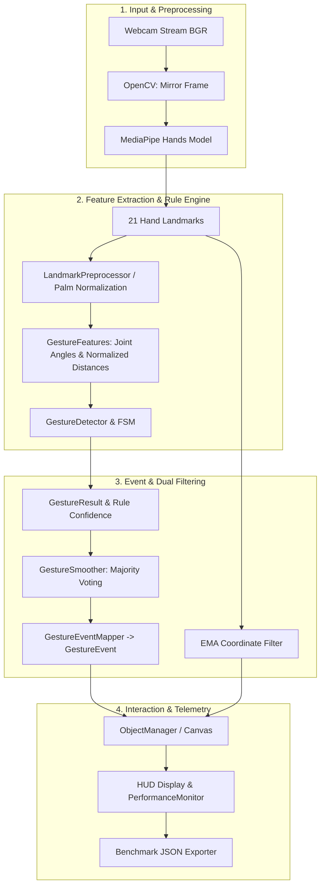

# 🖐️ Hand Gesture Controller


**Hand Gesture Controller** là ứng dụng desktop thị giác máy tính (Computer Vision / HCI) nhận diện cử chỉ tay theo thời gian thực để tương tác đồ họa không chạm (Contactless Spatial GUI Interaction) hoàn toàn trên thiết bị (edge processing), không gửi dữ liệu hình ảnh lên máy chủ.

Hệ thống kết hợp mô hình **MediaPipe Hands** với bộ luật hình học chuẩn hóa theo kích thước lòng bàn tay, bộ lọc mượt đa tầng (Multi-stage Smoothing) và Máy trạng thái hữu hạn (FSM) cho cử chỉ động.

Dự án được thiết kế theo tiêu chuẩn phần mềm chuyên nghiệp (Clean Code, PEP 8, Type Hints, Docstrings, Unit Testing & Integration Testing tự động), phù hợp làm sản phẩm prototype/portfolio điểm nhấn cho các vị trí **Software Engineer / Computer Vision Engineer / HCI Developer**.

---

## 🎯 Phạm Vi & Mục Tiêu Bài Toán

### Mục tiêu hệ thống:
- Điều khiển vị trí con trỏ và thao tác các vật thể đồ họa 2D (tạo mới, chọn/kéo thả, đổi màu, xóa) hoàn toàn bằng cử chỉ tay qua camera góc nhìn thẳng.
- Phân loại cử chỉ bằng bộ luật hình học rule-based trực tiếp trên 21 điểm mốc (landmarks) chuẩn hóa.
- Tốc độ xử lý đáp ứng thời gian thực với độ trễ được theo dõi thực nghiệm.

### Phạm vi phiên bản hiện tại:
- Nhận diện cử chỉ dựa trên 21 landmarks của MediaPipe Hands.
- Phân loại cử chỉ dựa trên luật hình học (Rule-based Geometry Engine).
- Ưu tiên xử lý một bàn tay chính trong khung hình.
- Hoạt động ổn định nhất khi bàn tay hướng trực diện về phía camera.
- **Lưu ý**: Đây là dự án prototype/portfolio về Computer Vision & HCI, không phải hệ thống phục vụ an toàn, y tế hoặc điều khiển thiết bị quan trọng.
- Machine Learning (KNN / SVM) là định hướng mở rộng thử nghiệm, chưa phải bộ phân loại mặc định trong ứng dụng chính.

---

## 📸 Demo & Tính Năng Tương Tác

| Cử Chỉ Tay | Hành Động Tương Tác Trong Ứng Dụng |
| :--- | :--- |
| **`On/Off`** (Chụp ngón trỏ & giữa) | Ẩn hoặc hiện toàn bộ giao diện canvas vật thể |
| **`Select`** (Chụm ngón trỏ + cái) | Chọn và kéo thả vật thể được làm mượt bằng EMA |
| **`Options`** (Chụm 3 ngón) | Đổi màu ngẫu nhiên cho vật thể tại vị trí con trỏ |
| **`Stop`** (Xòe 5 ngón) | Xóa vật thể tại vị trí con trỏ |
| **`MENU` + `Select`** | Mở trình đơn chọn hình và tạo vật thể mới (Tròn, Tam giác, Ngôi sao, Chữ nhật) |
| **`Wave`** (Vẫy tay) | Theo dõi chuyển động vẫy tay qua lại liên tiếp |
| **`SOS`** (Tín hiệu khẩn cấp) | Theo dõi chuỗi trạng thái xòe tay -> gập nắm đấm trong thời gian quy định |

### 🚀 Đặc Điểm Kỹ Thuật (Engineering Highlights):
- **Cấu hình ngưỡng hình học (`config.py`)**: Đưa toàn bộ threshold khoảng cách, góc ngón tay và timeout FSM vào Dataclass `GestureThresholds` có thể tinh chỉnh dễ dàng.
- **Chuẩn hóa theo kích thước lòng bàn tay (`gesture_features.py`)**: Khoảng cách khoảng giữa các điểm mốc được chia cho kích thước lòng bàn tay ($palm\_size = \text{dist}(wrist, middle\_mcp)$) giúp giảm phụ thuộc vào kích thước tay người dùng và khoảng cách camera.
- **Phần định ngón tay duỗi theo góc khớp**: Tính góc 3 khớp ngón tay ($\text{arccos}$) giúp nhận diện chính xác ngón duỗi/gập bất kể bàn tay bị xoay nghiêng.
- **Tách biệt nhận diện cử chỉ và hành động (`event_mapper.py`)**: Bộ luận trả về `GestureResult` (kèm rule confidence) và được chuyển thành `GestureEvent` ứng dụng độc lập với bộ phân loại.
- **Bộ lọc mượt đa tầng (Multi-stage Filtering)**:
  - *Tầng nhãn*: Biểu quyết đa số trong cửa sổ trượt (Sliding Window Majority Voting) giảm hiện tượng nhấp nháy nhãn (flickering).
  - *Tầng tọa độ*: Bộ lọc mũ Exponential Moving Average (EMA) giúp con trỏ chuyển động mượt mà.
- **Giám sát hiệu năng tự động (`performance_monitor.py`)**: Đo đạc FPS và Latency (ms) theo cửa sổ trượt, hỗ trợ xuất báo cáo định dạng JSON.

---

## 🏗️ Kiến Trúc Hệ Thống (System Architecture)



### Giải thích Tọa Độ Landmarks MediaPipe:
MediaPipe Hands trả về **21 điểm mốc** (landmarks):
- Tọa độ $x, y$ được chuẩn hóa tương đối theo chiều rộng và chiều cao khung hình ảnh trong khoảng $[0, 1]$.
- Tọa độ $z$ biểu diễn độ sâu tương đối so với vị trí cổ tay (gốc $z=0$ tại cổ tay, điểm càng gần camera có giá trị $z$ càng nhỏ). $z$ **không** được giả định nằm trong khoảng $[0, 1]$.

---

## 📂 Cấu Trúc Repository

```text
hand-gesture-recognition/
├── src/
│   └── hand_gesture_controller/   # Gói nguồn chính của ứng dụng
│       ├── __init__.py
│       ├── app.py                 # Ứng dụng chính & điều phối GUI/HUD
│       ├── config.py              # Dataclass cấu hình ngưỡng GestureThresholds
│       ├── event_mapper.py        # Chuyển đổi GestureResult thành GestureEvent
│       ├── finger_number.py       # Đếm và mã hóa số ngón tay nhị phân
│       ├── gesture_detector.py    # Trình luận cử chỉ dựa trên luật & FSM
│       ├── gesture_features.py    # Chuẩn hóa palm-size & tính góc khớp ngón tay
│       ├── gesture_smoother.py    # Thuật toán biểu quyết đa số mượt nhãn
│       ├── hand_detector.py       # Wrapper MediaPipe Hands
│       ├── object_manager.py      # Quản lý vật thể kéo thả 2D & lọc EMA
│       ├── performance_monitor.py # Ghi nhận và báo cáo FPS/Latency
│       └── preprocessing.py       # Preprocessor dịch gốc tọa độ & scaling
├── tools/
│   ├── collect_landmarks.py       # CLI thu thập dữ liệu landmarks xuất CSV
│   └── train_baseline.py          # Huấn luyện & đánh giá baseline KNN/SVM
├── tests/
│   ├── unit/                      # Unit tests độc lập không phụ thuộc camera
│   ├── integration/               # Integration tests pipeline dữ liệu giả lập
│   └── fixtures/
├── data/
│   └── README.md                  # Quy định schema CSV & protocol chống data leakage
├── docs/                          # Tài liệu kiến trúc & đánh giá
├── artifacts/                     # Thư mục lưu benchmark kết quả đo
├── pyproject.toml                 # Cấu hình dự án & linters/testers
├── Main.py                        # File tương thích khởi chạy ứng dụng
├── data_collector.py              # File tương thích khởi chạy tool thu thập
├── requirements.txt               # Thư viện chính
└── requirements-dev.txt           # Thư viện kiểm thử (pytest, ruff, mypy)
```

---

## ⚙️ Cài Đặt & Khởi Chạy

### Yêu cầu môi trường:
- **Python**: 3.10, 3.11, hoặc 3.12.
- **Phần cứng**: Webcam 720p/1080p.
- **Hệ điều hành**: Windows, Linux, macOS.

### 1. Cài đặt Virtual Environment

```bash
git clone <repository-url>
cd hand-gesture-recognition

python -m venv .venv
```

**Kích hoạt môi trường:**
- **Windows (PowerShell):**
  ```powershell
  .venv\Scripts\Activate.ps1
  python -m pip install --upgrade pip
  python -m pip install -r requirements.txt
  ```
- **Linux / macOS:**
  ```bash
  source .venv/bin/activate
  python -m pip install --upgrade pip
  python -m pip install -r requirements.txt
  ```

---

### 2. Chạy Ứng Dụng

```bash
python Main.py
```
*(Hoặc `python -m src.hand_gesture_controller.app`)*

**Tham số dòng lệnh (CLI Options):**

| Tham số | Mô tả | Mặc định |
| :--- | :--- | :--- |
| `--camera` | Index camera kết nối (phải $\ge 0$) | `0` |
| `--width` | Chiều rộng khung hình (phải $> 0$) | `640` |
| `--height` | Chiều cao khung hình (phải $> 0$) | `480` |
| `--smoothing-window` | Kích thước cửa sổ mượt nhãn (frame) | `5` |
| `--smoothing-votes` | Số phiếu tối thiểu đồng thuận | `3` |
| `--benchmark-output` | Đường dẫn file JSON xuất báo cáo FPS/Latency | `None` |
| `--log-level` | Mức ghi log (`DEBUG`, `INFO`, `WARNING`, `ERROR`) | `INFO` |

**Phím tắt điều khiển:**
- **`Q`**: Thoát ứng dụng và lưu file benchmark.
- **`D`**: Bật/tắt card hiển thị HUD FPS/Latency.
- **`C`**: Xóa toàn bộ vật thể trên canvas.

---

## 📊 Quy Trình Benchmark & Đo Đạc Hiệu Năng

Dự án cung cấp công cụ tự động xuất thông số FPS và Latency ra JSON:

```bash
python Main.py --benchmark-output artifacts/benchmark_results.json
```

Sau khi hoàn tất thao tác và nhấn `Q`, tệp `artifacts/benchmark_results.json` sẽ lưu báo cáo dạng:

```json
{
  "total_frames": 450,
  "elapsed_seconds": 15.023,
  "average_fps": 29.95,
  "average_latency_ms": 33.38
}
```

### Mẫu báo cáo benchmark chính thức (Điền sau khi đo thực nghiệm trên máy thật):
- **Thiết bị thử nghiệm**: Intel Core i5-1135G7 @ 2.40GHz, 16 GB RAM, Windows 11
- **Camera**: Integrated Webcam (1280×720 @ 30 FPS)
- **Thời lượng đo**: 5 phút tương tác thực tế
- **Kết quả đo đạc**:
  - FPS trung bình: *[Cần đo thực tế]*
  - Latency P95: *[Cần đo thực tế]* ms
  - Số khung hình đã xử lý: *[Cần đo thực tế]* frames

---

## 🤖 Thu Thập Dữ Liệu & Thử Nghiệm Machine Learning Baseline

Dự án hỗ trợ công cụ thu thập dataset 21 landmarks 3D chuẩn hóa xuất CSV (`tools/collect_landmarks.py`):

```bash
python tools/collect_landmarks.py \
  --subject-id subject_001 \
  --session-id session_001 \
  --label Fist \
  --samples 300 \
  --lighting normal \
  --output data/raw/landmarks_dataset.csv
```

### Quy định chống Data Leakage:
- **Phân chia split**: Chia `train`, `validation`, `test` theo `subject_id` (ví dụ: `subject_001` - `006` cho Train, `007` - `008` cho Val, `009` - `010` cho Test).
- **GroupKFold / Leave-One-Subject-Out**: Kiểm tra chéo phải nhóm theo `subject_id`, tuyệt đối không chia ngẫu nhiên từng khung hình.
- **Fit preprocessing**: Preprocessor (`preprocessing.py`) chỉ fit statistic trên tập train.

---

## 🧪 Kiểm Thử Tự Động (Automated Testing)

Dự án bao gồm bộ kiểm thử tự động đa tầng (Unit tests, Integration tests, Leakage tests):

Cài đặt thư viện kiểm thử:
```bash
python -m pip install -r requirements-dev.txt
```

Chạy toàn bộ pytest:
```bash
python -m pytest -v
```

Kiểm tra static typing và linting:
```bash
python -m ruff check .
python -m mypy src/
```

---

## 🔒 Quyền Riêng Tư (Privacy & Consent)

- **Xử lý tại chỗ (Edge Processing)**: Toàn bộ khung hình webcam được xử lý trực tiếp trên RAM thiết bị nội bộ. Ứng dụng không lưu hình ảnh/video và không gửi dữ liệu lên máy chủ ngoài.
- **Thu thập dữ liệu ẩn danh**: Công cụ thu thập chỉ ghi lại 21 cặp tọa độ số landmarks khi người dùng chủ động nhấn phím `S`.
- **Dữ liệu repository**: Thư mục `data/raw/` và `data/private/` chứa các tệp CSV/MP4 thực nghiệm cá nhân được đưa vào `.gitignore` để đảm bảo quyền riêng tư.

---

## ⚠️ Giới Hạn Dự Án (Limitations)

1. **Phụ thuộc vào MediaPipe Hands**: Nếu bàn tay bị che khuất một phần (occlusion), góc quay quá nghiêng hoặc ánh sáng quá yếu, chất lượng landmarks có thể giảm.
2. **Luật hình học rule-based**: Ngưỡng khoảng cách và góc ngón tay đã được chuẩn hóa theo $palm\_size$, tuy nhiên các tư thế tay quá đặc thù có thể đòi hỏi hiệu chỉnh ngưỡng cấu hình trong `GestureThresholds`.
3. **Môi trường sử dụng**: Đạt độ chính xác tốt nhất khi bàn tay ở khoảng cách $0.3 - 1.2$ m trước camera và mặt bàn tay hướng về phía webcam.

---

## 📜 Giấy Phép (License)

Dự án được phát hành theo giấy phép [MIT License](LICENSE).
